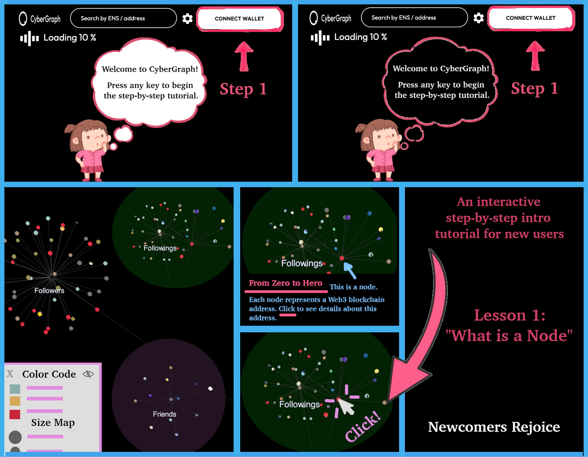
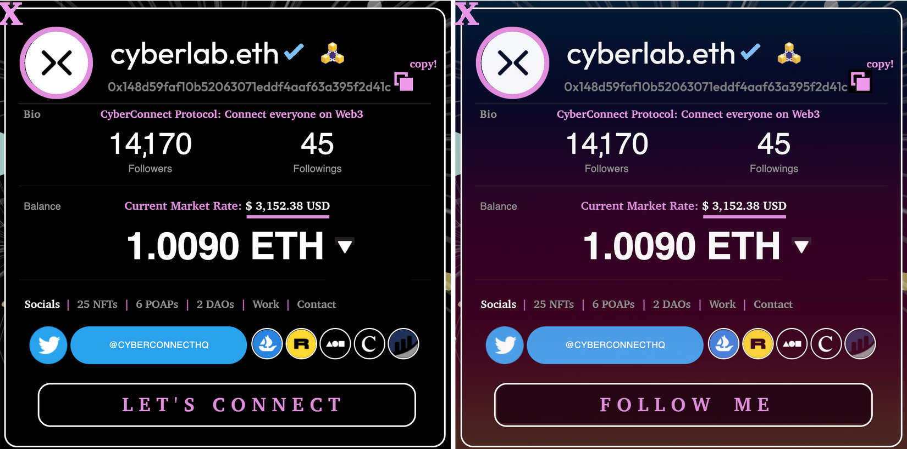
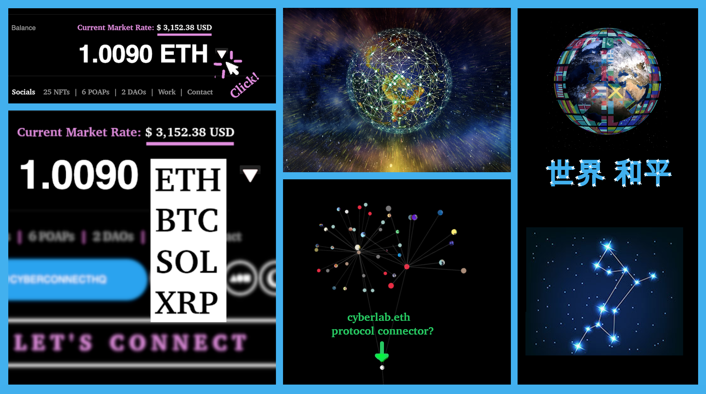

# Cybergraph Suggestions

🌀 **[Perspective](#perspective)** &nbsp; &nbsp; 🌀 **[Questions](#questions)** &nbsp; &nbsp; 🌀 **[Web Design](#web-design)** &nbsp; &nbsp; 🌀 **[UX](#ux)** &nbsp; &nbsp; 🌀 **[Suggested Features](#features)** &nbsp; &nbsp; 🌀 **[Visualizer](#visualizer)** &nbsp; &nbsp; 🌀 **[Inspiration](#inspiration)** &nbsp; &nbsp; 🌀 **[Resources](#resources)**

 

<h2>🔍 An Outside Perspective</h2>

**
POV:** Web3/Metaverse/Crypto newbie

First impression: "Wow this looks sick!" <strong>😍</strong>  
"What is this, what is it for, and what does it do though?" <strong>😲🤔</strong>

 

<h2>❓ Starter Questions</h2>

- Who is CyberGraph's target audience (Web3 data analysts/enthusiasts or any regular user)?

- What are the relationships between nodes & clusters? How does an outside viewer make sense of aggregated social connections?

- How come there are mini clusters formed around different labels/categories that don't branch out further or interconnect (like **🕸**)?

- Does each color + arc length represent some attribute, or are they randomly generated?

- What determines node size? What makes the few larger nodes so special?

- As the database of Web3 accounts grows, how will CyberGraph be rendered in optimal speed and presented without overcrowding (or is this the natural evolution of a social network graph)? 

- How can the complexity of a massive, interconnected network be simplified so that it is easy to read & interpret for laymen?

 

<h2>🌐 Web Design</h2>

- Make website responsive for all devices & screen sizes
- Bottom header text is cut off, scrolling is disabled
	- Adjust margin-top & remove padding from **`.Home_main__nLjiQ`**
- Change **`.scene-nav-info`** color & increase font-size for noticeability & readability
- Change CyberGraph PNG logo to SVG
- Find creative ways to fill in negative space
- See what I mean here: **<a href='assets/img/what-to-fix.png' target='_blank'>visual explainer</a>**&nbsp; 

 

<h2>👩🏻‍💻 User Experience</h2>

- ENS/address search doesn't work

- Improve user flow 
	- user clicks &nbsp; **`Let's Jump In!`**  &nbsp; ➡️ &nbsp; ❓🤔
	- open user panel on 1st node click; remove extra button click to view data

- Node event listeners
	* on mouse hover - show more interesting, useful info other than address
	* on single left mouse click - show dialog with address details
		- allow user to open, close, resize & reposition multiple dialogs in a single session (sort & filter)
	* on double left mouse click - zoom or rotate

- In cyber mode, show text labels
	- if cluster/node is clicked &nbsp;➡️&nbsp; switch to focus mode

- Add a no-frills, minimalist (2D) mode switch - downgrade to a less resource intensive version optimized for speed and performance, as graph grows larger (100.20 MB memory usage allocated for CyberGraph web app in current state - images make up 44.61% of allocation)
	- **why:** cater to users who want to look up single or multiple ENS/addresses in a central repo without having to load full 3D graph every time
	- heavy graphics rendering &nbsp;>&nbsp; 💻 CPU/GPU ♨️
	- alt option that can run on older machines, hardware, low RAM
	- design for accessibility 

- Provide starter instructions or guided intro for users to follow while the social graph loads (ELI5)  
	- **why:** not everyone is familiar with 3D graph data visualization 🙋🏻‍♀️ (\*best to not assume)
	- 3D graph takes time to load - fill in the vacancy
	- capture & hold attention to reduce bounce rate
		- impatience + short attention span + user has no idea what they're waiting for

- Add a properties chart - what do different colors, sizes, distances represent? Provide more context, scope & details

- Include creative interactions to improve user retention + engagement
	- Some ideas: space adventures, quests, games, complete space missions, collect points that can be used towards something, unlock mysteries, Easter eggs, treasure hunt, space voyage, training lessons, storyboards, travel among stars (nodes) to different galaxies (metaverses), tracing constellations, symbols, glyphs, etc.  

	- Consider adding animations, space themed objects (planets, comets, asteroids, meteors, black holes, superclusters, artificial satellites, astronauts, ...) to CyberVerse/CyberGraph. See <a href='#inspiration'>Inspiration</a> for a visual design example of an app that creatively incorporates animated graphics under a street view traffic theme to display a live blockchain transaction feed.

- Need some incentive to connect wallet to (d)app

 

<h2>🎴 Suggested Features</h2>

- **TL;DR &nbsp; [Skip to visualizer](#visualizer)**

- Nodes with variable properties (color, size, shape/symbol/icon, brightness, etc.) synced to user query & data type/object of interest 
	- (e.g. node size ⬆️ as tx count, account balance, or follower count ⬆️)

- Display mutual connections & common interests (followings, followers, memberships)

- Would be interesting to see social graphs of DAOs and the connections + interactions between council leaders + community members, as well as financial transactions on the blockchain (visualizing investments/funding in startups/nonprofits on a directed, weighted graph network with direction + arc thickness representing funding amount from source to receiver), displaying a transparent timeline of interactions. Or graphs of NFT trades/exchanges between addresses, generally on broad terms and specifically on narrow terms (e.g. all holders of a certain NFT)

- View account balance in any currency (crypto, fiat)
	- Convert ETH <-> BTC, USDC, ...
	- Show real-time value conversion in preferred fiat currency or stablecoin

- Web3 address cards
	- X out to graph view (there is no way to exit out atm)
	- option to upload or change avatar photo
	- replace generic default avatar with randomly generated, avatar graphic for user identities with missing avatars
	- replace 'Explore Me' to another action ('Follow', 'Connect', 'Contact')
	- instead of opening in new tab for every external link click, consider loading content in iframe/div within app 
	- switch between views (socials, NFTs, POAPs, virtual real estate, published work, donations, charitable causes)
	- holographic special edition cards for VIPs
	- badges, social tokenized reputation
	- identifiable markers for different account types (individual, business, nonprofit, investor)
		- ✔︎ if verified - (zero-knowledge) proof of identity
	- assign badges by trade/skill/profession/industry/field of interest (if specified)
	- real-time market cryptocurrency conversion
	- card flip, swap, trade (for other card types)
	- option to hide or show fields on personal card, set to public or private 
		- caveat: if everyone chooses to hide most fields then there will be nothing much to see...
	- shareable direct profile link

- personal/professional social network graph
	- display 1st, 2nd & 3rd degree connections in orgs, companies, events, etc.
	- show mutual friends, followings, memberships
	- verifiably random drawings for giveaways or 'airdrops'
	- create groups, send invites		
	- privacy settings

- enable filters + focus on certain subsets/regions/groups in network
	- on cluster hover - background glow or shadow effect
	- on cluster click - hide everything else that distracts
		- show vertical list of all addresses, connections, followings, txs	
	- render social graph and group clusters by property filters
		- filters: industry, account type (individual/business/nonprofit), balance/funding, activity, popularity, account age, etc.
		- e.g. all verified startups with account balance > 5 ETH, OG Web3 addresses 5+ years old, independent artists in music industry with < 50K followers
		- add glisten/glow/shine animation effect to nodes of interest	

- add alternative models or ways to visualize data, besides 3D graph form

- color coded transactions based on tx type (Transfer, Mint, Approve, Claim)

 

<h2>♠️ Visualizer</h2>

  

† Bottom right image of Canis Major sourced from Collins dictionary  

\* Balance conversion based on ETH market price at time of creation. Dropdown options shortened for brevity.  

\* Crypto coin symbols retrieved from Coin Market Cap's "Top 100 Crypto Coins by Market Capitalization" list.
(There are **9,700+ cryptocurrencies ?! 🙈**)

 

<h2>🍥 Inspiration</h2>

I stumbled upon **<a href='txstreet.com/' target='_blank'>this gem</a>** by chance. Perhaps the CyberConnect team can draw inspiration from the aforementioned project? 

Some takeaways:
- Landing page > live transaction visualizer
	- Introduces the project before launch. Describes what it is, what each object + property represents, and how to use

- Inviting, intuitive design & user experience
	- Fun, cool, colorful, vibrant, engaging, animated
	

 	

<h2>🔰 Resources</h2>

<strong><a href='https://youtube.com/watch?v=ja3r4EyM67E' target='_blank'>Beginner's Guide to Graph Visualization</a></strong>&nbsp; 

<strong><a href='https://youtube.com/watch?v=82zlRaRUsaY' target='_blank'>Graph Theory Overview</a></strong>&nbsp; 
